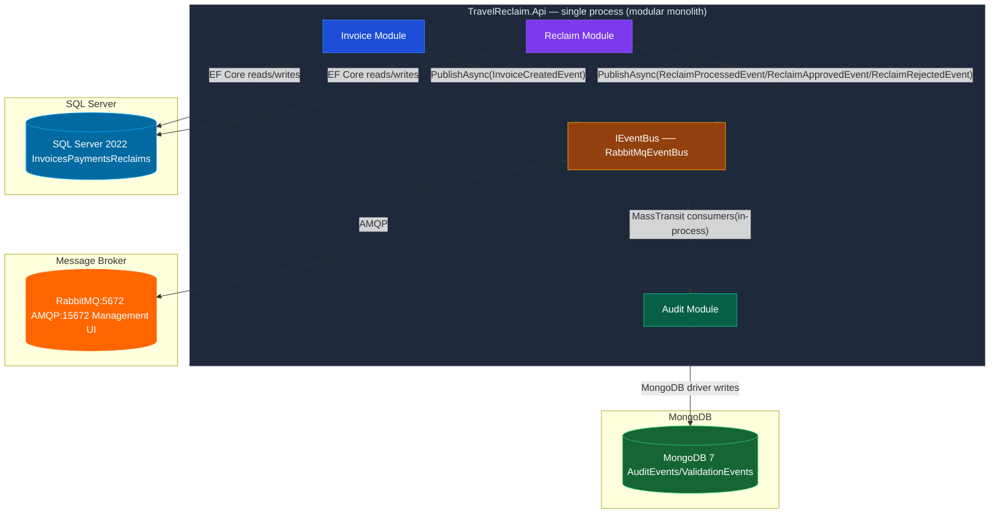

# ADR-002: Microservice Extraction Plan

**Date**: 2026-02-25

**Status**: Accepted

**Deciders**: Engineering team

---

## Context

The Travel Invoice Reclaim Platform is currently a **modular monolith** deployed as a single .NET 10 process. Three logical service boundaries exist within the codebase — Invoice, Reclaim, and Audit — but they share a deployment unit and, for Invoice + Reclaim, a SQL Server database.

Phase 3 introduced RabbitMQ (via MassTransit) as the event transport. CQRS handlers now publish domain events (`InvoiceCreatedEvent`, `ReclaimProcessedEvent`, `ReclaimApprovedEvent`, `ReclaimRejectedEvent`) rather than calling `IAuditService` directly. This architectural move was the critical enabler for future extraction: **publishers have zero knowledge of their consumers**.

This ADR documents the recommended extraction sequence, the triggering conditions for each step, and the cases where extraction should be deliberately deferred.

---

## Current Architecture



### Service boundary ownership

| Module  | Owns (data)                        | Publishes                                                               | Consumes                |
| ------- | ---------------------------------- | ----------------------------------------------------------------------- | ----------------------- |
| Invoice | `Invoices`, `Payments` tables      | `InvoiceCreatedEvent`                                                   | —                       |
| Reclaim | `Reclaims` table; reads `Invoices` | `ReclaimProcessedEvent`, `ReclaimApprovedEvent`, `ReclaimRejectedEvent` | —                       |
| Audit   | `auditEvents`, `validationEvents`  | —                                                                       | All domain events above |

### What already enables extraction

- `IEventBus` abstraction — publishers are transport-agnostic
- RabbitMQ broker running in Docker Compose from day one — production topology already exists
- MongoDB is already a **separate database** — Audit has no shared schema with Invoice/Reclaim
- MassTransit consumers are stateless — they can be moved to a separate host without code changes to publishers

---

## Extraction Order

### Step 1 — Extract Audit Service (lowest risk, highest readiness)

**Trigger**: Any of:

- Invoice volume exceeds 10K/month and audit write latency affects dashboard responsiveness
- Regulatory requirements mandate audit log isolation (separate process, separate credentials)
- Team grows to 3+ engineers and Audit becomes a clear ownership boundary

**Why this is the safest first extraction**:

1. **Already has its own database** — MongoDB `auditEvents` / `validationEvents` collections have no foreign keys into SQL Server. The data layer is already split.
2. **Communication is already event-based** — Invoice and Reclaim modules publish to RabbitMQ; they never call Audit directly. Extraction requires only moving the MassTransit consumers (`InvoiceCreatedConsumer`, `ReclaimProcessedConsumer`, etc.) to a new host process.
3. **Zero impact on existing services** — Invoice and Reclaim code has no reference to Audit internals. Publishers remain unchanged.
4. **Independent deployment and scaling** — Audit write throughput can be tuned (replicas, MongoDB write concern) without touching the core transactional services.

**What changes**:

```
Before:
  RabbitMQ exchange → MassTransit consumer (in-process) → IAuditService → MongoDB

After:
  RabbitMQ exchange → MassTransit consumer (TravelReclaim.AuditWorker process) → IAuditService → MongoDB
```

The `IEventHandler<TEvent>` implementations (`InvoiceCreatedEventHandler`, etc.) move to the new worker project. The Application-layer interfaces stay in a shared contracts library.

**At-least-once delivery**: Consumers must be idempotent. Current audit writes are append-only documents with no uniqueness constraint beyond `entityId + timestamp`. Add a unique index on `{ "entityId": 1, "action": 1, "timestamp": 1 }` before extraction to prevent duplicate audit entries on MassTransit retry.

---

### Step 2 — Split Invoice and Reclaim Services

**Trigger**: Any of:

- Independent release cadence required (Invoice changes blocked by Reclaim regression)
- Independent scaling required (e.g., batch CSV processing spikes need isolated compute)
- Team reaches 4+ engineers with clear ownership split

**The shared-database problem**:

Both Invoice and Reclaim currently read and write the same SQL Server database. Reclaim reads `Invoices` to validate before creating a `Reclaim` record. This is the primary coupling to resolve.

#### Option A — Synchronous REST call (recommended starting point)

Reclaim Service fetches invoice data from Invoice Service via an internal REST endpoint before running validation rules.

```
Reclaim Service
  └─► GET /internal/v1/invoices/{id}  (Invoice Service — not exposed via public API Gateway)
        └─► InvoiceRepository → SQL Server (Invoice DB)
```

- **Pro**: Simple, no data duplication, strong consistency
- **Con**: Reclaim availability depends on Invoice availability; latency adds up under load
- **Mitigation**: Polly circuit breaker + retry policy on the `HttpClient` (`AddHttpClient` + `AddResilienceHandler`)

#### Why REST and not gRPC here

This is a deliberate choice that deserves explicit reasoning.

gRPC's advantages:— binary Protobuf serialization, HTTP/2 multiplexing, lower latency — are compelling when call frequency is high (>1K QPS) or p99 latency has a sub-5ms SLA. Neither condition applies here. The Reclaim → Invoice call is triggered by a human submitting a reclaim. At 10K invoices/month that is ~0.004 QPS. The latency difference between JSON and Protobuf at that frequency is single-digit microseconds — irrelevant to any user-facing SLA.

More importantly, gRPC adds non-trivial operational cost:

| Concern            | REST                                             | gRPC                                                         |
| ------------------ | ------------------------------------------------ | ------------------------------------------------------------ |
| Transport          | HTTP/1.1, same port and pipeline as existing API | HTTP/2, separate port, separate ASP.NET Core listener        |
| Contract           | JSON — readable by every tool                    | `.proto` files — code-gen step in every CI/CD pipeline       |
| Observability      | Natively understood by every proxy and APM tool  | Requires explicit gRPC support (Envoy, grpc-gateway, etc.)   |
| Middleware         | Single pipeline for auth, logging, tracing       | Two pipelines to maintain                                    |
| Debugging          | `curl`, Postman, browser DevTools                | grpcurl, reflection must be enabled, custom tooling          |
| Error model        | RFC 7807 ProblemDetails (already established)    | gRPC status codes — different vocabulary, different mapping  |
| Contract evolution | URL versioning, additive JSON fields             | Permanent field numbers, deprecation discipline across teams |

For a ≤3-engineer team, that daily operational overhead is real, not hypothetical.

**The deeper point**: gRPC is a transport optimization — it makes a synchronous call faster. It does not eliminate the architectural problem, which is that **synchronous coupling means Reclaim Service availability depends on Invoice Service availability**. A circuit-breaker-protected REST call has identical failure modes to a gRPC call at this scale.

gRPC is the right answer for polyglot high-frequency internal data-plane calls (e.g., a pricing engine called 5K/second by multiple services in Go, Java, and .NET). It is not on the critical path for this system's evolution.

#### Option B — Event-sourced Invoice replica (target state at scale)

This is where the architecture should evolve when Option A latency becomes measurable.

Invoice Service publishes `InvoiceCreatedEvent` and `InvoiceStatusChangedEvent`. Reclaim Service maintains a local read-model of invoices — denormalized, eventually consistent.

```
Invoice Service
  └─► publishes InvoiceCreatedEvent / InvoiceStatusChangedEvent (RabbitMQ)
        └─► Reclaim Service consumer updates local InvoiceReadModel table
              └─► Validation rules read from InvoiceReadModel — no cross-service call at all
```

- **Pro**: Reclaim Service is fully autonomous — it can validate invoices even when Invoice Service is down, deploying, or slow. No circuit breaker needed. No cascading failure mode.
- **Con**: Eventual consistency window (seconds); Reclaim might validate against slightly stale invoice state.
- **Recommendation**: Migrate to Option B if Option A call latency exceeds the p95 SLA or Invoice Service availability drops below 99.9%.

**The senior-level framing**: REST now, async event sourcing later. The right evolution path for this call is REST → async events (which solves the coupling problem), not REST → gRPC (which does not). Spending architectural complexity budget on gRPC while the correct long-term answer is to eliminate the synchronous call entirely is a misallocation.

---

## When NOT to Extract

Microservice extraction has real costs: deployment complexity, network latency, distributed tracing, independent CI/CD pipelines, and inter-service contract versioning. Extract only when the benefit is concrete and measurable.

| Condition                             | Recommendation                                                                  |
| ------------------------------------- | ------------------------------------------------------------------------------- |
| Invoice volume < 10K/month            | Stay monolith — operational overhead is not justified                           |
| Team size ≤ 3 engineers               | Stay monolith — coordination overhead exceeds the value of separate deployments |
| No independent scaling requirement    | Stay monolith — a single scaled-out instance handles POC → 10x load             |
| No separate release cadence needed    | Stay monolith — coupled releases are a feature, not a bug, at this scale        |
| Audit latency not measurable by users | Defer Audit extraction — async event pattern already decouples it sufficiently  |

**Current assessment (POC)**: All conditions above apply. The modular monolith with RabbitMQ event bus is the correct architecture for the current scale. The extraction plan exists to guide the _when and how_, not to mandate _now_.

---

## Communication Patterns at Scale

| From → To         | Pattern                       | Technology                              | Notes                                          |
| ----------------- | ----------------------------- | --------------------------------------- | ---------------------------------------------- |
| Invoice → Audit   | Async events                  | RabbitMQ (MassTransit)                  | Already implemented. No change on extraction.  |
| Reclaim → Audit   | Async events                  | RabbitMQ (MassTransit)                  | Already implemented. No change on extraction.  |
| Reclaim → Invoice | Sync REST (Phase 1 of split)  | HTTP + Polly circuit breaker            | Internal endpoint, not exposed via API Gateway |
| Reclaim → Invoice | Async event-sourced (Phase 2) | RabbitMQ + local InvoiceReadModel table | Migrate when sync latency becomes measurable   |

---

## Data Consistency Strategy

### Invoice + Payment (within Invoice Service boundary)

Full **ACID** guarantees within a single SQL Server instance. `RowVersion` optimistic concurrency on all mutable entities. No consistency trade-off required.

### Reclaim creation (cross-boundary operation)

In the monolith, creating a `Reclaim` and transitioning the Invoice to `ReclaimPending` is a single database transaction. After extraction, this becomes a distributed operation requiring a **Saga**.

**Choreography-based saga — Reclaim Processing**:

```
1. Reclaim Service: fetch Invoice via REST (Invoice Service)
2. Reclaim Service: run validation rules
3. Reclaim Service: INSERT Reclaim (Status = Pending)          ← local commit
4. Reclaim Service: publish ReclaimCreatedEvent
5. Invoice Service: consume event → UPDATE Invoice Status = ReclaimPending
   ├─ Success: publish InvoiceStatusUpdatedEvent (optional confirmation)
   └─ Failure: publish InvoiceStatusUpdateFailedEvent
              → Reclaim Service compensates: UPDATE Reclaim Status = Failed
              → publish ReclaimCreationFailedEvent
              → notify client via SignalR
```

No central orchestrator — each service reacts to events and publishes compensating events on failure. MassTransit's `SagaStateMachine` can formalize the state machine when the complexity warrants it.

### Audit (append-only, no consistency requirements)

Audit events are immutable, append-only documents. At-least-once delivery with idempotent consumer is sufficient. No distributed transaction needed.

---

## Summary of Extraction Readiness

| Service | Database           | Communication         | Code Coupling                        | Extraction Readiness            |
| ------- | ------------------ | --------------------- | ------------------------------------ | ------------------------------- |
| Audit   | Separate (MongoDB) | Event-based only      | None — pure consumer                 | **High — ready when triggered** |
| Invoice | Shared SQL Server  | Sync + Event producer | Low — publishes events, no consumers | Medium — requires DB split      |
| Reclaim | Shared SQL Server  | Sync + Event producer | Medium — reads Invoice table         | Low — requires Saga pattern     |

---

## Consequences

**Positive**

- Extraction path is defined and de-risked before it is needed
- RabbitMQ topology from Phase 3 means publishers require zero code changes at extraction time
- REST-first for the Reclaim → Invoice call keeps operational complexity low while the service boundary is validated
- "When NOT to extract" criteria prevent premature decomposition

**Negative / trade-offs**

- Shared SQL Server database remains a coupling point for Invoice + Reclaim until Step 2 is triggered
- Saga implementation (Step 2) adds code complexity that is not needed in the monolith phase
- Distributed tracing (OpenTelemetry / Jaeger) becomes mandatory after any extraction to maintain observability across service boundaries

---

## Alternatives Considered

| Option                                               | Why rejected                                                                                                                                                                                                        |
| ---------------------------------------------------- | ------------------------------------------------------------------------------------------------------------------------------------------------------------------------------------------------------------------- |
| gRPC for Reclaim → Invoice internal call             | Transport optimization that does not solve the coupling problem; operational cost (proto files, separate port, tooling) unjustified at this call frequency; async event sourcing is the correct long-term direction |
| Extract all three services simultaneously            | High risk, high coordination cost, no clear benefit at current scale                                                                                                                                                |
| Domain-partitioned databases from day one            | Over-engineering for POC; premature optimization before access patterns are validated                                                                                                                               |
| In-memory event bus first, migrate to RabbitMQ later | Creates a migration step with no observable benefit; RabbitMQ via MassTransit established the production topology from day one (see ADR-001)                                                                        |
